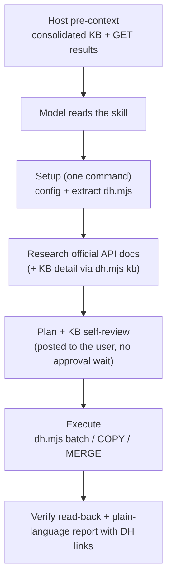

# viaSocket Developer Hub — Skill Architecture

How the three skills in `skills/` work and how to run them.

## 1. Prompt templates

Fill the placeholders and send to the model. The host loads the pre-context (§2) before the skill runs.

### 1.1 Plug — `SKILL-PLUG-CREATION.md`

Create or extend a whole plug: branding, connection, reusable components, every action and trigger.

```text
Build Plug Integrations in viaSocket Read https://raw.githubusercontent.com/RoystonSanctis/dh-planner-viasocket/refs/heads/dev/skills/SKILL-PLUG-CREATION.md and follow it.

Input:
ORG_ID: <YOUR_ORG_ID>
APP_NAME: <APP_NAME>
APP_DOMAIN: <APP_DOMAIN>
API_BASE: <API_BASE_URL>
PROXY_AUTH_TOKEN: <YOUR_PROXY_AUTH_TOKEN>
USECASE: <DESCRIPTION_OF_INTEGRATION_GOALS>
```

* `ORG_ID` — viaSocket organization ID (e.g. `org_abc123`).
* `APP_NAME` / `APP_DOMAIN` — app name and primary domain (e.g. `Slack` / `slack.com`).
* `API_BASE` — Developer Hub API base URL (production, testing or local).
* `PROXY_AUTH_TOKEN` — temporary token for Developer Hub calls; stored only in `.dh-run/config.json`, deleted at the end.
* `USECASE` — optional scope (e.g. "CRUD actions for Contacts, webhook trigger for new deals"). Empty → every action and trigger.

### 1.2 Connection — `SKILL-CONNECTION.md`

Create, edit, or copy into a new version one connection (`oauth_details`) of an existing plug.

```text
Build Plug Connection in viaSocket Read https://raw.githubusercontent.com/RoystonSanctis/dh-planner-viasocket/refs/heads/dev/skills/SKILL-CONNECTION.md and follow it.

Input:
ORG_ID: <YOUR_ORG_ID>
PLUGIN_ID: <PLUGIN_RECORD_ID>
APP_NAME: <APP_NAME>
APP_DOMAIN: <APP_DOMAIN>
PREFERRED_AUTH_ID: <EXISTING_AUTH_ID_OR_EMPTY>
API_BASE: <API_BASE_URL>
PROXY_AUTH_TOKEN: <YOUR_PROXY_AUTH_TOKEN>
REQUEST: <WHAT_AUTH_TO_CONFIGURE>
```

* `PREFERRED_AUTH_ID` — optional connection to change or copy. Empty → the plug's preferred connection.
* `REQUEST` — e.g. "OAuth 2.0 authorization code with scopes read, write" or "add an api_key header".

### 1.3 Action / trigger — `SKILL-ACTION.md`

Create or update one action or trigger of an existing plug (always on a draft version).

```text
Build Plug Action in viaSocket Read https://raw.githubusercontent.com/RoystonSanctis/dh-planner-viasocket/refs/heads/dev/skills/SKILL-ACTION.md and follow it.

Input:
ENTITY_TYPE: <action | trigger>
ORG_ID: <YOUR_ORG_ID>
PLUGIN_ID: <PLUGIN_RECORD_ID>
APP_NAME: <APP_NAME>
APP_DOMAIN: <APP_DOMAIN>
SKILL_MODE: <create | update>
ACTION_ID: <ACTION_ID_IF_UPDATE>
ACTION_NAME: <ACTION_OR_TRIGGER_NAME>
VERSION_ID: <CONFIRMED_DRAFT_VERSION_ID_IF_UPDATE>
PREFERRED_AUTH_ID: <PREFERRED_AUTH_ID>
API_BASE: <API_BASE_URL>
PROXY_AUTH_TOKEN: <YOUR_PROXY_AUTH_TOKEN>
REQUEST: <WHAT_THIS_ACTION_OR_TRIGGER_DOES>
UPDATE_CONTEXT: <CHANGES_REQUESTED_IF_UPDATING>
```

* `SKILL_MODE` — `create` or `update`.
* `ACTION_ID`, `ACTION_NAME`, `VERSION_ID`, `PREFERRED_AUTH_ID`, `UPDATE_CONTEXT` — optional; resolved from the rows
  (action by name/key; latest draft, or a new draft copied from the latest version — never a `published` one).

## 2. Architecture: pre-context + process + tool



1. **Pre-context (host):** before the skill runs, the host loads the consolidated KB and the GET results the skill
   needs. The skills say "don't re-fetch"; anything missing is fetched with `node dh.mjs GET`.

   | Skill | Consolidated KB | GET results |
   | ----- | --------------- | ----------- |
   | Plug | `dh-knowledgebase.md` + `dh-connection-kb.md` | org's plugs; for a plug on the domain: details, connections, connection usage, actions, components |
   | Connection | `dh-connection-kb.md` | plug, connections, connection usage |
   | Action | `dh-knowledgebase.md` | plug, connections, actions, components |

2. **Skill = process + tools; KB = knowledge.** A skill holds only the steps, the Developer Hub REST contract (where
   it overrides the KB payload schemas) and the tool. Design and runtime knowledge (UX, fields, naming, code rules,
   runtime globals and limits, review priorities) lives in `knowledge-base/`; detailed files are read on demand with
   `node dh.mjs kb <file> "Heading"`.
3. **Research → plan → execute.** Ask only at the start if a required input is missing; post the plan in plain
   language, then execute without an approval pause.
4. **One link, one tool.** `dh.mjs` is embedded at the end of each skill in a four-backtick `js file=dh.mjs` fence;
   the setup command extracts it (`\r?\n`-tolerant regex, so Windows checkouts work). The model is told not to re-type it.
5. **Parallel single-row calls.** Developer Hub endpoints take one row per call; `batch` runs 4 at a time per level.

## 3. Skill comparison

| | Plug | Connection | Action |
| - | ---- | ---------- | ------ |
| **Scope** | whole plug (create or extend) | one connection | one action or trigger |
| **Branching** | domain match → extend, else create | create · edit in place (non-breaking, unused) · `COPY` to a new version (breaking or in use) | create · edit draft · `COPY` latest version to a new draft |
| **Execution** | L0 plug · L1 connection ∥ components ∥ brand details · L2 actions/triggers ∥ plug MERGE · L3 versions ∥ mappings | write → plug MERGE | components → action → version ∥ mappings → action MERGE |
| **Embedded tool** | full | no `batch`, no action/component checks | no connection encoding |

## 4. `dh.mjs`

```text
node dh.mjs GET   '<path>' [key,key]                  read; only those keys of each row; retried once on network error / 5xx
node dh.mjs POST|PUT|PATCH '<path>' '{json}'|@file    write
node dh.mjs MERGE 'update/<plugins|actions>?identifier=<id>&filter=…' '{changes}'
node dh.mjs COPY  'get/<oauth_details|action_version>?identifier=<parentId>&filter=<f>' '{"rowid":"<id>",…changes}'
node dh.mjs batch @ops.json                           [{ label, method, path, body?, keys? }] → [{ label, ok, result | error }]
node dh.mjs kb [file] ["Heading"… | '*']              KB files · headings · sections · whole file
```

Paths are relative to `<API_BASE>/developers/<ORG_ID>/`; a leading `/` is relative to `<API_BASE>`. Config:
`.dh-run/config.json` (`apiBase`, `orgId`, `token`, `skill`, optional `kbRepo`/`kbRef`). Every call is logged to
`.dh-run/log.jsonl` (method, path, status — never the token).

Automatic behaviour:

* **Syntax check before a write** — code blocks (`perform`, `performlist`, `performsubscribe`, `performunsubscribe`,
  `modifytriggerdata`, `transferoption`, component `code`), connection code, every field generator (recursively) and
  every `authenticationpaths` value (must be a function body that `return`s).
* **Provenance** — `create/*` gets a `metadata.aiLogs` `CREATED_BY_AI` entry (+ `metadata.createdBy` on plugs);
  `create/actions` then sets `isaiaction` + `aiorgid` and returns `{ actionId, versionId }` (a failed follow-up
  returns the ids with a `warning`, so nothing is created twice).
* **MERGE** — reads the row, keeps every metadata key, deep-merges `metadata.aiContext` (+ `updatedAt`) and appends an
  `UPDATED_BY_AI` entry (optional `note`).
* **COPY** — reads the parent's rows, copies the one with `rowid` minus DB-managed keys (`rowid`, `autonumber`,
  timestamps, creator keys, `metadata`; connections also `pluginname`, `pluginiconurl`, `domain`, `isencrypted`,
  `clientsecret`; versions also `version`, `versionid`, `status`, `isdeleted`, `actionversionrecordid`,
  `publishdescription`), applies the changes, adds `metadata.duplicatedfrom` and creates it. Versions become
  `drafted` under the parent action; connections keep `authversion` (the server numbers it).
* **Connection encoding** — `testcode`, `accesstokencode`, `refreshtokencode`, `revokeapicode` accept raw JS and are
  stored as `{"source": …}` strings; a `queryparams` object is stringified.
* **KB reader** — files are fetched from GitHub on first use and cached in `.dh-kb/`; headings match exact →
  normalized → partial (ignoring code fences); a miss lists the closest headings; a section over 24,000 characters
  returns its intro plus its sub-section names.

## 5. Operational rules

1. **Token** — never printed, logged or committed; lives only in `.dh-run/config.json`, removed at the end.
2. **Credentials** — never asked for in chat (client ID/secret, API keys, passwords). The developer enters them in
   Developer Hub; the skill leaves them empty.
3. **Never publish, never hard-delete, never edit a `published` version** — changes go to a `drafted` version or a
   new copy.
4. **Branch / fork** — setup commands point to `dev`. For another branch or fork, use that skill URL and set
   `kbRepo`/`kbRef` in `.dh-run/config.json` (defaults `RoystonSanctis/dh-planner-viasocket` / `dev`).
5. **Editing the tool** — the three embedded copies are variants of one tool (plug = full). Change all three together
   and keep the fence exactly: four backticks + `js file=dh.mjs` to open, four backticks to close.
