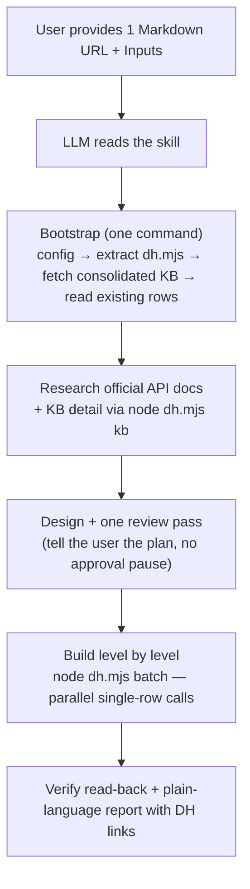

# viaSocket Developer Hub — Skill Architecture & Operational Guide

This document describes how the self-contained skills in `dh-planner-viasocket` work and how to run them.

---

## 1. Ready-to-Use Prompt Templates

Below are the exact prompt templates and input schemas to provide to any LLM (Claude, ChatGPT, Gemini, etc.). Simply fill in the placeholders and submit to the model.

### 1.1 PLUG-CREATION-SKILL

Use this skill to create or extend an entire plug from scratch, including branding, connection/authentication, reusable helper components, and all actions/triggers.

```text
Build Plug Integrations in viaSocket Read https://raw.githubusercontent.com/RoystonSanctis/dh-planner-viasocket/refs/heads/dev/skills/SKILL-PLUG-CREATION.md and follow it.

Input:
ORG_ID: <YOUR_ORG_ID>
APP_NAME: <APP_NAME>
APP_DOMAIN: <APP_DOMAIN>
API_BASE: <API_BASE_URL>
PROXY_AUTH_TOKEN: <YOUR_PROXY_AUTH_TOKEN>
USECASE: <DESCRIPTION_OF_INTEGRATION_GOALS>
```

#### Field Descriptions:
* `ORG_ID`: Your viaSocket organization ID (e.g., `org_abc123`).
* `APP_NAME`: Human-readable name of the application (e.g., `Slack`, `Shopify`).
* `APP_DOMAIN`: Primary domain of the service (e.g., `slack.com`, `shopify.com`).
* `API_BASE`: Developer Hub API base URL (e.g., `https://flow.viasocket.com` or local dev instance).
* `PROXY_AUTH_TOKEN`: Temporary authentication token for viaSocket DH API calls (stored only in `.dh-run/config.json`).
* `USECASE`: Optional summary of what needs to be created or extended (e.g., "Build CRUD actions for Contacts and Webhook triggers for new deals"). Empty → every trigger and action.

---

### 1.2 CONNECTION-CREATION-SKILL

Use this skill to configure, update, or fork an authentication connection (`oauth_details`) for an existing plug without touching actions or triggers.

```text
Build Plug Connection in viaSocket Read https://raw.githubusercontent.com/RoystonSanctis/dh-planner-viasocket/refs/heads/dev/skills/SKILL-CONNECTION.md and follow it.

Input:
ORG_ID: <YOUR_ORG_ID>
PLUGIN_ID: <PLUGIN_RECORD_ID>
APP_NAME: <APP_NAME>
APP_DOMAIN: <APP_DOMAIN>
PREFERRED_AUTH_ID: <EXISTING_AUTH_ID_OR_EMPTY>
API_BASE: <API_BASE_URL>
PROXY_AUTH_TOKEN: <YOUR_PROXY_AUTH_TOKEN>
REQUEST: <WHAT_AUTH_TO_CONFIGURE>
```

#### Field Descriptions:
* `PLUGIN_ID`: Target plug record ID in Developer Hub.
* `PREFERRED_AUTH_ID`: Optional ID of the connection to update or copy. Empty → the plug's preferred connection.
* `REQUEST`: Concrete instructions regarding auth setup (e.g., "Set up OAuth 2.0 with authorization code grant and scopes: read, write" or "Add api_key header to existing API Key auth").

---

### 1.3 ACTION-CREATION-UPDATE-SKILL

Use this skill to create or update an individual action or trigger on an existing plug.

```text
Build Plug Action in viaSocket Read https://raw.githubusercontent.com/RoystonSanctis/dh-planner-viasocket/refs/heads/dev/skills/SKILL-ACTION.md and follow it.

Input:
ENTITY_TYPE: <action | trigger>
ORG_ID: <YOUR_ORG_ID>
PLUGIN_ID: <PLUGIN_RECORD_ID>
APP_NAME: <APP_NAME>
APP_DOMAIN: <APP_DOMAIN>
SKILL_MODE: <create | update>
ACTION_ID: <ACTION_ID_IF_UPDATE>
ACTION_NAME: <ACTION_OR_TRIGGER_NAME>
VERSION_ID: <CONFIRMED_DRAFT_VERSION_ID_IF_UPDATE>
PREFERRED_AUTH_ID: <PREFERRED_AUTH_ID>
API_BASE: <API_BASE_URL>
PROXY_AUTH_TOKEN: <YOUR_PROXY_AUTH_TOKEN>
REQUEST: <WHAT_THIS_ACTION_OR_TRIGGER_DOES>
UPDATE_CONTEXT: <CHANGES_REQUESTED_IF_UPDATING>
```

#### Field Descriptions:
* `ENTITY_TYPE`: Either `action` or `trigger`.
* `SKILL_MODE`: `create` for a new action/trigger; `update` to modify an existing action/trigger draft.
* `ACTION_ID`, `ACTION_NAME`, `VERSION_ID`, `PREFERRED_AUTH_ID`, `UPDATE_CONTEXT`: Optional. Empty → resolved from the API (action by name/key; latest non-deleted draft, or a new draft cloned from the latest version — never a `published` one).
* `UPDATE_CONTEXT`: Specific diff details when updating (e.g., "Add optional 'tag' input field and pass it in the query params").

---

## 2. Core Architecture: One Link, One Tool

One URL gives the LLM everything: the process, the Developer Hub API contract, the runtime rules and one small embedded tool (`dh.mjs`). Knowledge (UX, field JSON, code rules, review priorities) stays in `knowledge-base/` and is fetched live.



### Architectural Pillars

1. **Autonomous execution, plain language:** clarify only at the start when a required input or the goal is missing; then research → build → report without mid-process approvals and without technical jargon.
2. **Skill = process, KB = knowledge:** the skill holds the steps, API endpoints/payload shapes and runtime facts; the knowledge base holds design knowledge. The consolidated KB (`dh-knowledgebase.md`, `dh-connection-kb.md`) is downloaded in full at bootstrap; detailed docs are searched by heading on demand.
3. **The LLM orchestrates, the tool guards:** the LLM writes each payload and runs levels with `batch`; `dh.mjs` handles the parts that are easy to get wrong (see §4).
4. **Self-extracting tool fence:** `dh.mjs` is embedded at the end of each skill in a quad-backtick ```` ```js file=dh.mjs ```` fence; the bootstrap extracts it with a Node one-liner. The LLM is told "do not read or re-type", which saves tokens.
5. **Single-row, parallel API calls:** Developer Hub endpoints take one row per call; independent calls run in parallel (4 at a time) inside a level.

---

## 3. Skill Comparison Matrix

| Capability | [SKILL-PLUG-CREATION.md](SKILL-PLUG-CREATION.md) | [SKILL-CONNECTION.md](SKILL-CONNECTION.md) | [SKILL-ACTION.md](SKILL-ACTION.md) |
| :--- | :--- | :--- | :--- |
| **Primary Scope** | Complete plug (create or extend) | One connection | One action or trigger |
| **Consolidated KB fetched** | `dh-knowledgebase.md` + `dh-connection-kb.md` | `dh-connection-kb.md` | `dh-knowledgebase.md` |
| **Existing rows read at bootstrap** | All plugs (match by domain) | Plug, connections, connection usage | Plug, connections, actions, components |
| **Branching** | Domain match → extend vs create | Create · edit in place (non-breaking, unused) · new version (breaking or in use) | Create · edit draft · clone latest version to a new draft |
| **Build levels** | 0 plug · 1 connection ∥ details · 2 components · 3 actions/triggers · 4 versions ∥ mappings · 5 plug finalize | write → plug MERGE | components → action → version ∥ mappings → action MERGE |

---

## 4. The Embedded Tool — `dh.mjs`

Commands:

```
node dh.mjs GET|POST|PUT|PATCH '<path>' ['{json}' | @body.json]     one call
node dh.mjs MERGE 'update/<plugins|actions>?identifier=<id>&filter=…' '{changes}'
node dh.mjs batch @calls.json      [{ label, method, path, body }] → 4 in parallel → [{ label, ok, result | error }]
node dh.mjs kb [file.md] ["Heading" …]    list KB files · heading tree · sections
```

Paths are relative to `<API_BASE>/developers/<ORG_ID>/`; a leading `/` is relative to `<API_BASE>`. Config lives in `.dh-run/config.json` (`apiBase`, `orgId`, `token`, `skill`); every call is logged (method, path, status — never the token) to `.dh-run/log.jsonl`.

Automatic behaviour:

* **Syntax check before any write:** every code block (`perform`, `performlist`, `performsubscribe`, `performunsubscribe`, `modifytriggerdata`, `transferoption`, component `code`, connection code), every dropdown/field generator (recursively), and every `authenticationpaths` value (must be a function body that `return`s). A syntax error stops the call before it reaches Developer Hub.
* **Provenance:** `create/*` gets a `metadata.aiLogs` `CREATED_BY_AI` entry; `create/plugins` also gets `metadata.createdBy`; `create/actions` then sets `isaiaction: true` + `aiorgid` and returns `{ actionId, versionId }` (if that follow-up fails, the ids are still returned with a `warning`, so nothing is created twice).
* **Metadata-safe updates:** `MERGE` reads the row, keeps every metadata key, deep-merges `metadata.aiContext` (+ `updatedAt`) and appends an `UPDATED_BY_AI` entry (optional `note`).
* **Connection encoding:** `testcode`, `accesstokencode`, `refreshtokencode`, `revokeapicode` accept raw JS (or a `{source}` object/string) and are stored once-wrapped as `{"source": …}` strings; a `queryparams` object is stringified.
* **Short results:** creates return `{ id }` (`oauth_details` adds `authversion`).
* **Vectorless RAG (`kb`):** knowledge-base files are discovered at run time (GitHub contents API, folder-page fallback) and cached in `.dh-kb/`. Headings are matched exact → normalized → partial, ignoring headings inside code fences; a section over 24,000 characters returns its own intro plus its sub-section names to ask for next.

What the tool intentionally does **not** do (the LLM does it, guided by the skill): plan files, dependency resolution, component-mapping discovery, resume state, offline VM simulation.

---

## 5. Best Practices & Operational Rules

1. **Token Security:**
   * Never output, log, or commit the `PROXY_AUTH_TOKEN`.
   * Write it once to `.dh-run/config.json`, which is deleted at the end of the run (`rm .dh-run/config.json`).
2. **Credential Handling (Client ID, Client Secret, Passwords, API Keys):**
   * Never ask the user for Client ID, Client Secret, Passwords, or API Keys in the chat.
   * The user/developer manually enters their credentials directly in the viaSocket platform UI (Developer Hub / Flow).
   * The AI only configures the connection schema, endpoints, scopes, authenticationpaths, and testcode, leaving root client credentials null/empty or as placeholders.
3. **Never Edit Published Versions:**
   * In viaSocket Developer Hub, `published` versions are immutable to protect live user workflows.
   * Updates to an existing entity must target a non-deleted `drafted` version, or clone the latest version into a new draft.
4. **Cross-Platform Compatibility:**
   * In the tool extractor regex:
     ```javascript
     s.matchAll(/^\x60{4}js file=(\S+)\r?\n([\s\S]*?)\r?\n\x60{4}$/gm)
     ```
     Always support `\r?\n` to guarantee extraction works across Linux, macOS, and Windows checkouts.
5. **Branch Configuration:**
   * By default, bootstrap scripts point to the `dev` branch:
     `R=https://raw.githubusercontent.com/RoystonSanctis/dh-planner-viasocket/refs/heads/dev`
   * If working from a feature branch or fork, set `R` to the part of the skill link before `/skills/`. `dh.mjs kb` reads `kbRepo`/`kbRef` from `.dh-run/config.json` (default `RoystonSanctis/dh-planner-viasocket` / `dev`).
