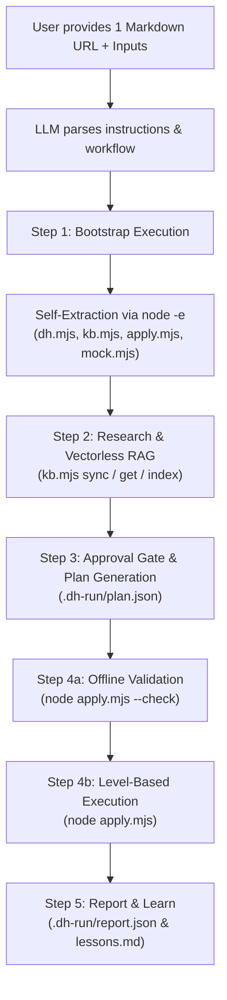

# viaSocket Developer Hub — Skill Architecture & Operational Guide

This document provides a comprehensive architectural breakdown and operational guide for the self-contained skills in the viaSocket Developer Hub (`dh-planner-viasocket`).

---

## 1. Ready-to-Use Prompt Templates

Below are the exact prompt templates and input schemas to provide to any LLM (Claude, ChatGPT, Gemini, etc.). Simply fill in the placeholders and submit to the model.

### 1.1 PLUG-CREATION-SKILL

Use this skill to create or extend an entire plug from scratch, including branding, connection/authentication, reusable helper components, and all actions/triggers.

```text
Build Plug Integrations in viaSocket Read https://raw.githubusercontent.com/RoystonSanctis/dh-planner-viasocket/refs/heads/dev/skills/SKILL-PLUG-CREATION.md and follow it.

Input:
ORG_ID: <YOUR_ORG_ID>
APP_NAME: <APP_NAME>
APP_DOMAIN: <APP_DOMAIN>
API_BASE: <API_BASE_URL>
PROXY_AUTH_TOKEN: <YOUR_PROXY_AUTH_TOKEN>
USECASE: <DESCRIPTION_OF_INTEGRATION_GOALS>
```

#### Field Descriptions:
* `ORG_ID`: Your viaSocket organization ID (e.g., `org_abc123`).
* `APP_NAME`: Human-readable name of the application (e.g., `Slack`, `Shopify`).
* `APP_DOMAIN`: Primary domain of the service (e.g., `slack.com`, `shopify.com`).
* `API_BASE`: Developer Hub API base URL (e.g., `https://flow.viasocket.com` or local dev instance).
* `PROXY_AUTH_TOKEN`: Temporary authentication token for viaSocket DH API calls (stored only in `.dh-run/config.json`).
* `USECASE`: Summary of what needs to be created or extended (e.g., "Build CRUD actions for Contacts and Webhook triggers for new deals").

---

### 1.2 CONNECTION-CREATION-SKILL

Use this skill to configure, update, or fork an authentication connection (`oauth_details`) for an existing plug without touching actions or triggers.

```text
Build Plug Connection in viaSocket Read https://raw.githubusercontent.com/RoystonSanctis/dh-planner-viasocket/refs/heads/dev/skills/SKILL-CONNECTION.md and follow it.

Input:
ORG_ID: <YOUR_ORG_ID>
PLUGIN_ID: <PLUGIN_RECORD_ID>
APP_NAME: <APP_NAME>
APP_DOMAIN: <APP_DOMAIN>
PREFERRED_AUTH_ID: <EXISTING_AUTH_ID_OR_EMPTY>
API_BASE: <API_BASE_URL>
PROXY_AUTH_TOKEN: <YOUR_PROXY_AUTH_TOKEN>
REQUEST: <WHAT_AUTH_TO_CONFIGURE>
```

#### Field Descriptions:
* `PLUGIN_ID`: Target plug record ID in Developer Hub.
* `PREFERRED_AUTH_ID`: ID of current preferred connection (if updating or cloning).
* `REQUEST`: Concrete instructions regarding auth setup (e.g., "Set up OAuth 2.0 with authorization code grant and scopes: read, write" or "Add api_key header to existing API Key auth").

---

### 1.3 ACTION-CREATION-UPDATE-SKILL

Use this skill to create or update an individual action or trigger on an existing plug.

```text
Build Plug Action in viaSocket Read https://raw.githubusercontent.com/RoystonSanctis/dh-planner-viasocket/refs/heads/dev/skills/SKILL-ACTION.md and follow it.

Input:
ENTITY_TYPE: <action | trigger>
ORG_ID: <YOUR_ORG_ID>
PLUGIN_ID: <PLUGIN_RECORD_ID>
APP_NAME: <APP_NAME>
APP_DOMAIN: <APP_DOMAIN>
SKILL_MODE: <create | update>
ACTION_ID: <ACTION_ID_IF_UPDATE>
ACTION_NAME: <ACTION_OR_TRIGGER_NAME>
VERSION_ID: <CONFIRMED_DRAFT_VERSION_ID_IF_UPDATE>
PREFERRED_AUTH_ID: <PREFERRED_AUTH_ID>
API_BASE: <API_BASE_URL>
PROXY_AUTH_TOKEN: <YOUR_PROXY_AUTH_TOKEN>
REQUEST: <WHAT_THIS_ACTION_OR_TRIGGER_DOES>
UPDATE_CONTEXT: <CHANGES_REQUESTED_IF_UPDATING>
```

#### Field Descriptions:
* `ENTITY_TYPE`: Either `action` or `trigger`.
* `SKILL_MODE`: `create` for a new action/trigger; `update` to modify an existing action/trigger draft.
* `ACTION_ID` & `VERSION_ID`: Required for updates. `VERSION_ID` must point to a confirmed `drafted` version (never `published`).
* `UPDATE_CONTEXT`: Specific diff details when updating (e.g., "Add optional 'tag' input field and pass it in the query params").

---

## 2. Core Architecture: The Single-File Self-Contained Pattern

The skills follow a self-contained paradigm: **one single URL provides the complete operating manual, workflow constraints, schema contracts, and runtime executable tools.**



### Architectural Pillars

1. **Separation of Reasoning vs Deterministic Execution:**
   * **The LLM** is responsible for: Domain research, API evidence gathering, user approval gating, and producing a strictly structured `.dh-run/plan.json`.
   * **The JavaScript Engine (`apply.mjs`)** is responsible for: Network requests, payload generation, dependency ordering, component mapping, stringification, and schema validation. The LLM never writes direct API mutation scripts.
2. **Self-Extracting Tool Fencing:**
   The tools are embedded at the end of each `.md` file using quad-backtick code fences:
   ````markdown
   ````js file=dh.mjs
   ...
   ````
   ````
   The bootstrap command extracts these files locally using a lightweight Node.js stream one-liner. The LLM is explicitly instructed: `"do not read or re-type"`, saving tokens and preventing hallucinations.
3. **Idempotent & Resumable Execution:**
   All execution state is tracked in `.dh-run/state.json`. If a network error or validation failure occurs, re-running `node apply.mjs` resumes from the exact failed step without re-creating already registered entities.
4. **Offline AST & Rule Linting (`--check`):**
   Before any HTTP write occurs, `node apply.mjs --check` executes offline checks:
   * JS syntax compilation via `new AsyncFunction()`.
   * Detection of prohibited VM globals (`URL`, `btoa`, `require`, `process`, `console.log`).
   * Enforcement of optional chaining (`context?.authData?.xyz`).
   * Verification that all variables referenced in code exist in `inputData` schema.

---

## 3. Skill Comparison Matrix

| Capability | [SKILL-PLUG-CREATION.md](file:///Users/royston/Github/viaSocket/dh-planner-viasocket/skills/SKILL-PLUG-CREATION.md) | [SKILL-CONNECTION.md](file:///Users/royston/Github/viaSocket/dh-planner-viasocket/skills/SKILL-CONNECTION.md) | [SKILL-ACTION.md](file:///Users/royston/Github/viaSocket/dh-planner-viasocket/skills/SKILL-ACTION.md) |
| :--- | :--- | :--- | :--- |
| **Primary Scope** | Complete plug lifecycle | Plug connection / auth details | Individual Action or Trigger |
| **Active Levels in apply.mjs** | Levels 0, 1, 2, 3, 4, 5 | Levels 0, 1, 5 | Levels 0, 2, 3, 4, 5 |
| **Embedded Tools** | `dh.mjs`, `kb.mjs`, `apply.mjs`, `mock.mjs` | `dh.mjs`, `kb.mjs`, `apply.mjs` | `dh.mjs`, `kb.mjs`, `apply.mjs`, `mock.mjs` |
| **RAG Modules Queried** | `dh_plug`, `dh_action_trigger`, `dh_connection` | `dh_connection` | `dh_action_trigger` |
| **Target Mode Handling** | Creates new plug or resolves by domain | Resolves by `PLUGIN_ID` | Resolves by `PLUGIN_ID` + `ACTION_ID` |
| **Branching Decisions** | Match domain -> extend vs create | `create` vs `update` vs `clone` | `create` vs `edit draft` vs `clone draft` |
| **Offline Testing (`mock.mjs`)**| Yes (for multi-step / complex items) | No (tests directly in DH with `testcode`) | Yes (for complex triggers & pagination) |

---

## 4. The Embedded Execution Engine

Each skill carries a synchronized runtime engine consisting of the following tools:

### 4.1 `dh.mjs` — Developer Hub REST Client
* Reads environment configuration from `.dh-run/config.json`.
* Transparently routes requests relative to `/developers/<orgId>/` or absolute URLs.
* Automatically includes `proxy_auth_token`, `Content-Type: application/json`, and `ngrok-skip-browser-warning`.
* Maintains an append-only JSONL execution log at `.dh-run/log.jsonl`.

### 4.2 `kb.mjs` — Vectorless Hierarchical RAG
* Synchronizes knowledge base markdown documentation without vector databases.
* Hierarchical fallback discovery:
  1. Local path via `KB_SRC`.
  2. Git shallow clone (`git clone -q --depth 1`).
  3. GitHub Contents REST API.
  4. Web scraping fallback of the repository folder listing.
* Indexes document headings (`#` to `######`) and extracts subsections on demand (`node kb.mjs get <kb> "<Heading>"`).
* Caps output size (`--max=24000`) and lists child sections if truncated, preserving context window efficiency.

### 4.3 `apply.mjs` — 6-Level Dependency Pipeline
All mutations in Developer Hub flow through `apply.mjs` across 6 strict dependency tiers:

```
Level 0: Plug Creation / Resolution
    │   └── Creates plug row or queries existing plug by domain.
    ▼
Level 1: Connection & Plug Details (Parallel)
    │   ├── Connection: create (V1) | update in place | clone to V(N+1).
    │   └── Details: Fetches brand details (logo, color, tags) & updates metadata.
    ▼
Level 2: Reusable Components
    │   └── Compiles and registers standalone helper functions (e.g., appRequest).
    ▼
Level 3: Actions & Triggers
    │   └── Creates action rows, drafts versions, sets category/sub_category.
    ▼
Level 4: Component Mappings & Verification
    │   ├── Scans perform/dropdown code with regex (\b<fn>\s*\() to link components.
    │   └── Performs read-back verification against inputjson.blocks in DH.
    ▼
Level 5: Final Plug Finalization
        └── Unions whitelist domains, sets preferedauthversion, updates aiContext.
```

### 4.4 `mock.mjs` — Local VM Sandbox Simulator
* Included in `SKILL-PLUG-CREATION.md` and `SKILL-ACTION.md`.
* Simulates viaSocket's restricted JavaScript execution environment.
* Injects mock `axios`, `context` (`inputData`, `authData`, `paginateData`), and error handlers to test complex triggers and pagination routines before applying them to Developer Hub.

---

## 5. Best Practices & Operational Rules

1. **Token Security:**
   * Never output, log, or commit the `PROXY_AUTH_TOKEN`.
   * Write it once to `.dh-run/config.json`, which is deleted at the end of the run (`rm .dh-run/config.json`).
2. **Never Edit Published Versions:**
   * In viaSocket Developer Hub, `published` versions are immutable to protect live user workflows.
   * Updates to an existing entity must target an unreleased `drafted` version or use `cloneFrom` to create a new draft.
3. **Cross-Platform Compatibility:**
   * In the tool extractor regex:
     ```javascript
     s.matchAll(/^\x60{4}js file=(\S+)\r?\n([\s\S]*?)\r?\n\x60{4}$/gm)
     ```
     Always support `\r?\n` to guarantee extraction works across Linux, macOS, and Windows checkouts.
4. **Branch Configuration:**
   * By default, bootstrap scripts point to the `dev` branch:
     `R=https://raw.githubusercontent.com/RoystonSanctis/dh-planner-viasocket/refs/heads/dev`
   * If working from a feature branch or fork, update the `R` variable in the bootstrap command.
